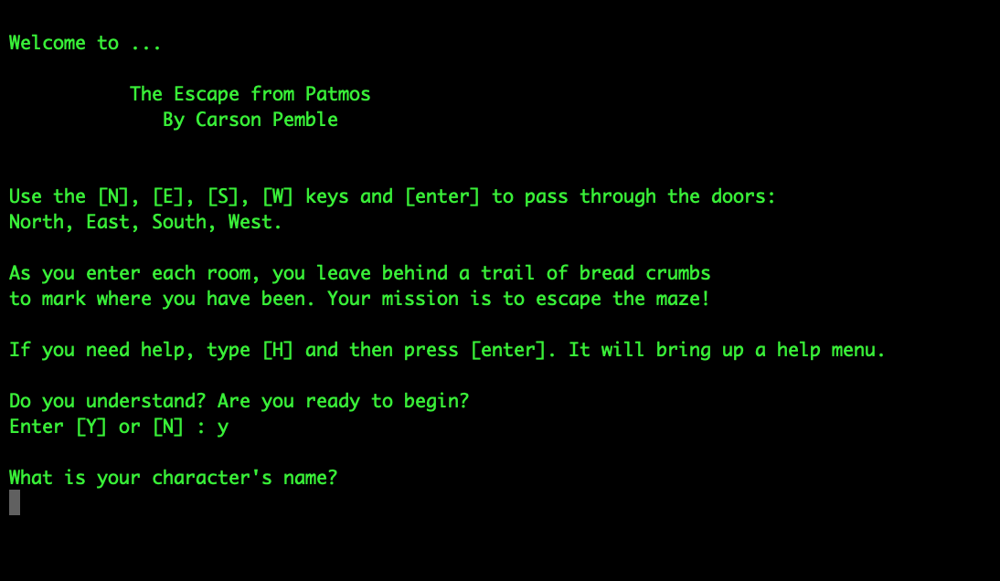

# EscapeFromPatmos
A text-based adventure game. This command line interface game originated as a simple c++ assignment but grew into much more. I really enjoyed creating this game and I hope you enjoy playing it.

##### Compiling the Game #####
Download the zip file from this GitHub page.
 Unzip the "EscapeFromPatmos-master" folder.
 Open up a new terminal at the new folder.
 The "ls" command should show a list of all the files.
 Once you are in the correct directory (should be something like Users/.../Downloads/EscapeFromPatmos-master) 
 Compile the game by typing this in the commandline: *g++ \*.cpp -g -std=c++11 -m32 -o game.exe*

##### Running the Game #####
Once the game has compiled type: *./game.exe*

##### Playing the Game #####
Tip #1 Your character's name can't have spaces... sorry.

Tip #2 Navigate by pressing: s
        and then press enter.
        (you can go North: n
                    South: s
                    East: e
                    West: w)

Tip #3 Equip your weapon and armor as soon as you find them

Tip #4 You can type: !
        to end the game.

Tip #5 You can type: h
        to get in-game help.

### HAVE FUN! ###
